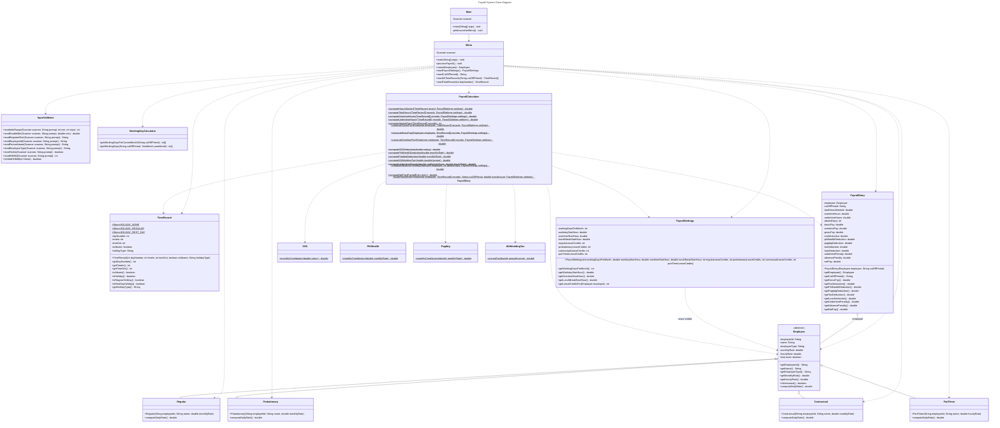

# Class Diagram

```mermaid
---
title: Payroll System Class Diagram
---
classDiagram
    class Main {
        -Scanner scanner
        +main(String[] args) void
        -printLauncherMenu() void
    }

    class Menu {
        -Scanner scanner
        +main(String[] args) void
        +processPayroll() void
        +createEmployee() Employee
        +readPayrollSettings() PayrollSettings
        +readCutOffPeriod() String
        +readAllTimeRecords(String cutOffPeriod) TimeRecord[]
        +readTimeRecord(int dayNumber) TimeRecord
    }

    class InputValidator {
        +readIntInRange(Scanner scanner, String prompt, int min, int max) int
        +readDoubleMin(Scanner scanner, String prompt, double min) double
        +readRequiredText(Scanner scanner, String prompt) String
        +readEmployeeId(Scanner scanner, String prompt) String
        +readPersonName(Scanner scanner, String prompt) String
        +readEmployeeType(Scanner scanner, String prompt) String
        +readYesNo(Scanner scanner, String prompt) boolean
        +readHHMM(Scanner scanner, String prompt) int
        +isValidHHMM(int hhmm) boolean
    }

    class WorkingDayCalculator {
        +getWorkingDaysForCurrentMonth(String cutOffPeriod) int[]
        +getWorkingDays(String cutOffPeriod, YearMonth yearMonth) int[]
    }

    class Employee {
        <<abstract>>
        -employeeId: String
        -name: String
        -employeeType: String
        -monthlyRate: double
        -hourlyRate: double
        -hasLeave: boolean
        +getEmployeeId() String
        +getName() String
        +getEmployeeType() String
        +getMonthlyRate() double
        +getHourlyRate() double
        +isHasLeave() boolean
        +computeDailyRate() double*
    }

    class Regular {
        +Regular(String employeeId, String name, double monthlyRate)
        +computeDailyRate() double
    }

    class Probationary {
        +Probationary(String employeeId, String name, double monthlyRate)
        +computeDailyRate() double
    }

    class Contractual {
        +Contractual(String employeeId, String name, double monthlyRate)
        +computeDailyRate() double
    }

    class PartTimer {
        +PartTimer(String employeeId, String name, double hourlyRate)
        +computeDailyRate() double
    }

    class TimeRecord {
        +String HOLIDAY_NONE$
        +String HOLIDAY_REGULAR$
        +String HOLIDAY_REST_DAY$
        -dayNumber: int
        -timeIn: int
        -timeOut: int
        -isAbsent: boolean
        -holidayType: String
        +TimeRecord(int dayNumber, int timeIn, int timeOut, boolean isAbsent, String holidayType)
        +getDayNumber() int
        +getTimeIn() int
        +getTimeOut() int
        +isAbsent() boolean
        +isHoliday() boolean
        +isRegularHoliday() boolean
        +isRestDayHoliday() boolean
        +getHolidayType() String
    }

    class PayrollSettings {
        -workingDaysPerMonth: int
        -workdayStartHour: double
        -overtimeStartHour: double
        -lunchBreakStartHour: double
        -regularLeaveCredits: int
        -probationaryLeaveCredits: int
        -contractualLeaveCredits: int
        -partTimerLeaveCredits: int
        +PayrollSettings(int workingDaysPerMonth, double workdayStartHour, double overtimeStartHour, double lunchBreakStartHour, int regularLeaveCredits, int probationaryLeaveCredits, int contractualLeaveCredits, int partTimerLeaveCredits)
        +getWorkingDaysPerMonth() int
        +getWorkdayStartHour() double
        +getOvertimeStartHour() double
        +getLunchBreakStartHour() double
        +getLeaveCreditsFor(Employee employee) int
    }

    class PayrollEntry {
        -employee: Employee
        -cutOffPeriod: String
        -totalHoursWorked: double
        -overtimeHours: double
        -undertimeHours: double
        -absentDays: int
        -basicPay: double
        -overtimePay: double
        -grossPay: double
        -sssDeduction: double
        -philhealthDeduction: double
        -pagibigDeduction: double
        -taxDeduction: double
        -loanDeduction: double
        -undertimePenalty: double
        -absencePenalty: double
        -netPay: double
        +PayrollEntry(Employee employee, String cutOffPeriod)
        +getEmployee() Employee
        +getCutOffPeriod() String
        +getGrossPay() double
        +getSssDeduction() double
        +getPhilhealthDeduction() double
        +getPagibigDeduction() double
        +getTaxDeduction() double
        +getLoanDeduction() double
        +getUndertimePenalty() double
        +getAbsencePenalty() double
        +getNetPay() double
    }

    class PayrollCalculator {
        +computeHoursWorked(TimeRecord record, PayrollSettings settings) double$
        +computeTotalHours(TimeRecord[] records, PayrollSettings settings) double$
        +computeOvertimeHours(TimeRecord[] records, PayrollSettings settings) double$
        +computeUndertimeHours(TimeRecord[] records, PayrollSettings settings) double$
        +computeAbsentDays(TimeRecord[] records) int$
        +computeGrossPay(Employee employee, TimeRecord[] records, PayrollSettings settings) double$
        +computeBasicPay(Employee employee, TimeRecord[] records, PayrollSettings settings) double$
        +computeOvertimePay(Employee employee, TimeRecord[] records, PayrollSettings settings) double$
        +computeSSSDeduction(double salary) double$
        +computePhilHealthDeduction(double monthlyRate) double$
        +computePagibigDeduction(double monthlyRate) double$
        +computeWithholdingTax(double taxableIncome) double$
        +computeUndertimePenalty(double undertimeHours, double hourlyRate) double$
        +computeAbsencePenalty(Employee employee, int absentDays, PayrollSettings settings) double$
        +computeNetPay(PayrollEntry entry) double$
        +buildPayrollEntry(Employee employee, TimeRecord[] records, String cutOffPeriod, double loanAmount, PayrollSettings settings) PayrollEntry$
    }

    class SSS {
        +monthlyContribution(double salary) double$
    }

    class PhilHealth {
        +monthlyContribution(double monthlyRate) double$
    }

    class Pagibig {
        +monthlyContribution(double monthlyRate) double$
    }

    class WithholdingTax {
        +annualTax(double annualIncome) double$
    }

    Main --> Menu
    Menu ..> InputValidator
    Menu ..> WorkingDayCalculator
    Menu ..> PayrollCalculator
    Menu ..> PayrollSettings
    Menu ..> TimeRecord
    Menu ..> PayrollEntry
    Menu ..> Employee
    Menu ..> Regular
    Menu ..> Probationary
    Menu ..> Contractual
    Menu ..> PartTimer

    Employee <|-- Regular
    Employee <|-- Probationary
    Employee <|-- Contractual
    Employee <|-- PartTimer

    PayrollEntry o-- Employee : employee
    PayrollSettings ..> Employee : leave credits

    PayrollCalculator ..> Employee
    PayrollCalculator ..> TimeRecord
    PayrollCalculator ..> PayrollSettings
    PayrollCalculator ..> PayrollEntry
    PayrollCalculator ..> SSS
    PayrollCalculator ..> PhilHealth
    PayrollCalculator ..> Pagibig
    PayrollCalculator ..> WithholdingTax
```