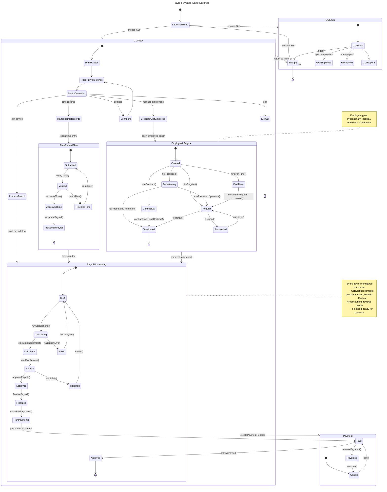

# State Diagram

```mermaid
---
title: Payroll System State Diagram
---
stateDiagram-v2

    %% Top-level launcher
    [*] --> LauncherMenu
    LauncherMenu --> CLIFlow: choose CLI
    LauncherMenu --> GUIStub: choose GUI
    LauncherMenu --> ExitApp: choose Exit

    %% CLI flow (high-level)
    state CLIFlow {
        [*] --> PrintHeader
        PrintHeader --> ReadPayrollSettings
        ReadPayrollSettings --> SelectOperation

        state SelectOperation <<choice>>
        SelectOperation --> CreateOrEditEmployee: manage employees
        SelectOperation --> ProcessPayroll: run payroll
        SelectOperation --> ManageTimeRecords: time records
        SelectOperation --> Configure: settings
        SelectOperation --> ExitCLI: exit

        CreateOrEditEmployee --> EmployeeLifecycle: open employee editor
        ManageTimeRecords --> TimeRecordFlow: open time entry
        ProcessPayroll --> PayrollProcessing: start payroll flow
        Configure --> ReadPayrollSettings

        ExitCLI --> [*]
    }

    %% GUI placeholder
    state GUIStub {
        [*] --> GUIHome
        GUIHome --> GUIEmployee: open employees
        GUIHome --> GUIPayroll: open payroll
        GUIHome --> GUIReports
        GUIHome --> ExitApp: logout
    }

    %% Employee lifecycle (detailed)
    state EmployeeLifecycle {
        [*] --> Created
        Created --> Probationary: hireProbation()
        Created --> Contractual: hireContract()
        Created --> PartTimer: hirePartTime()
        Created --> Regular: hireRegular()

        Probationary --> Regular: passProbation / promote()
        Probationary --> Terminated: failProbation / terminate()

        Contractual --> Terminated: contractEnd / endContract()
        PartTimer --> Regular: convertToRegular / convert()
        Regular --> Suspended: suspend()
        Suspended --> Regular: reinstate()

        Regular --> Terminated: terminate()
        Terminated --> [*]
    }

    %% Time record flow
    state TimeRecordFlow {
        [*] --> Submitted
        Submitted --> Verified: verifyTime()
        Verified --> ApprovedTime: approveTime()
        Verified --> RejectedTime: rejectTime()
        RejectedTime --> Submitted: resubmit()

        ApprovedTime --> IncludedInPayroll: includeInPayroll()
        IncludedInPayroll --> [*]
    }

    %% Payroll processing (detailed with choices and error paths)
    state PayrollProcessing {
        [*] --> Draft
        Draft --> Calculating: runCalculations()
        Calculating --> Calculated: calculationsComplete
        Calculated --> Review: sendForReview()
        Review --> Approved: approvePayroll()
        Review --> Rejected: auditFail()
        Rejected --> Draft: revise()
        Approved --> Finalized: finalizePayroll()
        Finalized --> RunPayments: schedulePayments()
        RunPayments --> Paid: paymentsDispatched
        Paid --> Archived: archivePayroll()
        Archived --> [*]

        %% error and rollback paths
        Calculating --> Failed: validationError
        Failed --> Draft: fixData()/retry
    }

    %% Payment states
    state Payment {
        [*] --> Unpaid
        Unpaid --> Paid: pay()
        Paid --> Reversed: reversePayment()
        Reversed --> Unpaid: reinstate()
    }

    %% Cross-state interactions (events linking flows)
    TimeRecordFlow --> PayrollProcessing: timeIncluded
    EmployeeLifecycle --> PayrollProcessing: removeFromPayroll
    PayrollProcessing --> Payment: createPaymentRecords

    %% Exit
    CLIFlow --> ExitApp: return to Main
    GUIStub --> ExitApp: logout
    ExitApp --> [*]

    %% Notes
    note right of PayrollProcessing
        - Draft: payroll configured but not run
        - Calculating: compute gross/net, taxes, benefits
        - Review: HR/accounting reviews results
        - Finalized: ready for payment
    end note

    note left of EmployeeLifecycle
        Employee types: Probationary, Regular, PartTimer, Contractual
    end note
```
