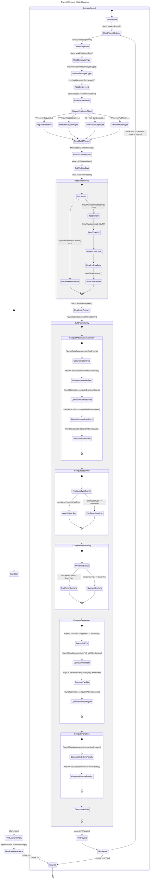

# State Diagram

```mermaid
---
title: Payroll System State Diagram
---
stateDiagram-v2

    [*] --> MainStart
    MainStart --> PrintLauncherMenu: Main.main()
    PrintLauncherMenu --> ReadLauncherChoice: InputValidator.readIntInRange()

    ReadLauncherChoice --> ProcessPayroll: choice == 1
    ReadLauncherChoice --> ExitApp: choice == 3

    state ProcessPayroll {
        [*] --> PrintHeader
        PrintHeader --> ReadPayrollSettings: Menu.processPayroll()

        ReadPayrollSettings --> CreateEmployee: Menu.createEmployee()
        CreateEmployee --> ReadEmployeeType: Menu.readEmployeeType()
        ReadEmployeeType --> ValidateEmployeeType: InputValidator.readEmployeeType()
        ValidateEmployeeType --> ReadEmployeeId: InputValidator.readEmployeeId()
        ReadEmployeeId --> ReadPersonName: InputValidator.readPersonName()
        ReadPersonName --> ChooseEmployeeClass

        state ChooseEmployeeClass <<choice>>
        ChooseEmployeeClass --> RegularEmployee: "R" / new Regular(...)
        ChooseEmployeeClass --> ProbationaryEmployee: "P" / new Probationary(...)
        ChooseEmployeeClass --> ContractualEmployee: "C" / new Contractual(...)
        ChooseEmployeeClass --> PartTimerEmployee: "T" / new PartTimer(...)

        RegularEmployee --> ReadCutOffPeriod
        ProbationaryEmployee --> ReadCutOffPeriod
        ContractualEmployee --> ReadCutOffPeriod
        PartTimerEmployee --> ReadCutOffPeriod

        ReadCutOffPeriod --> ReadAllTimeRecords: Menu.readAllTimeRecords()
        ReadAllTimeRecords --> GetWorkingDays: Menu.getWorkingDays()
        GetWorkingDays --> ReadTimeRecord: Menu.readTimeRecord()

        state ReadTimeRecord {
            [*] --> AskAbsent
            AskAbsent --> ReturnAbsentRecord: InputValidator.readYesNo() == Y
            AskAbsent --> ReadTimeIn: InputValidator.readYesNo() == N
            ReadTimeIn --> ReadTimeOut: InputValidator.readHHMM()
            ReadTimeOut --> ValidateTimeOrder
            ValidateTimeOrder --> ReadHolidayType
            ReadHolidayType --> BuildTimeRecord: new TimeRecord(...)
            ReturnAbsentRecord --> [*]
            BuildTimeRecord --> [*]
        }

        ReadTimeRecord --> ReadLoanAmount: Menu.readLoanAmount()
        ReadLoanAmount --> BuildPayrollEntry: PayrollCalculator.buildPayrollEntry()

        state BuildPayrollEntry {
            [*] --> ComputeAttendanceSummary
            ComputeAttendanceSummary --> ComputeBasicPay
            ComputeBasicPay --> ComputeOvertimePay
            ComputeOvertimePay --> ComputeDeductions
            ComputeDeductions --> ComputePenalties
            ComputePenalties --> ComputeNetPay
            ComputeNetPay --> [*]

            state ComputeAttendanceSummary {
                [*] --> ComputeTotalHours: PayrollCalculator.computeTotalHours()
                ComputeTotalHours --> ComputeHoursWorked: PayrollCalculator.computeHoursWorked()
                ComputeHoursWorked --> ComputeOvertimeHours: PayrollCalculator.computeOvertimeHours()
                ComputeOvertimeHours --> ComputeUndertimeHours: PayrollCalculator.computeUndertimeHours()
                ComputeUndertimeHours --> ComputeAbsentDays: PayrollCalculator.computeAbsentDays()
                ComputeAbsentDays --> [*]
            }

            state ComputeBasicPay {
                [*] --> EmployeeTypeBranch
                EmployeeTypeBranch --> PartTimerBasicPay: employeeType == PartTimer
                EmployeeTypeBranch --> MonthlyBasicPay: employeeType != PartTimer
                MonthlyBasicPay --> [*]
                PartTimerBasicPay --> [*]
            }

            state ComputeOvertimePay {
                [*] --> OvertimeBranch
                OvertimeBranch --> PartTimerOvertime: employeeType == PartTimer
                OvertimeBranch --> SalariedOvertime: employeeType != PartTimer
                PartTimerOvertime --> [*]
                SalariedOvertime --> [*]
            }

            state ComputeDeductions {
                [*] --> ComputeSSS: PayrollCalculator.computeSSSDeduction()
                ComputeSSS --> ComputePhilHealth: PayrollCalculator.computePhilHealthDeduction()
                ComputePhilHealth --> ComputePagibig: PayrollCalculator.computePagibigDeduction()
                ComputePagibig --> ComputeWithholdingTax: PayrollCalculator.computeWithholdingTax()
                ComputeWithholdingTax --> [*]
            }

            state ComputePenalties {
                [*] --> ComputeUndertimePenalty: PayrollCalculator.computeUndertimePenalty()
                ComputeUndertimePenalty --> ComputeAbsencePenalty: PayrollCalculator.computeAbsencePenalty()
                ComputeAbsencePenalty --> [*]
            }
        }

        BuildPayrollEntry --> PrintPayslip: Menu.printPayslip()
        PrintPayslip --> NextAction

        state NextAction <<choice>>
        NextAction --> ReadPayrollSettings: choice == 1 / process another payroll
        NextAction --> ExitApp: choice == 2 / exit
    }

    ExitApp --> [*]
```
