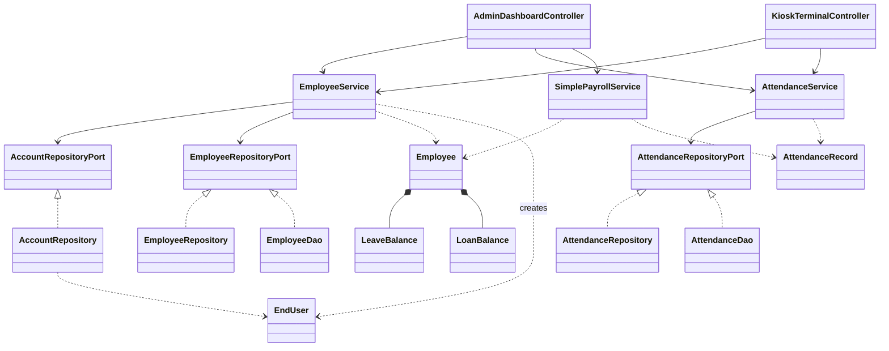
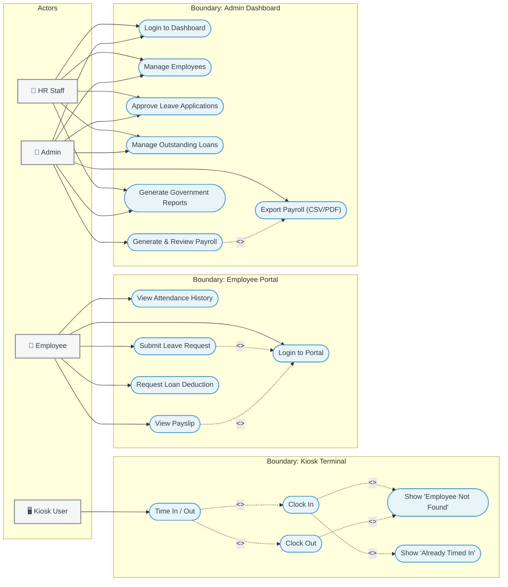
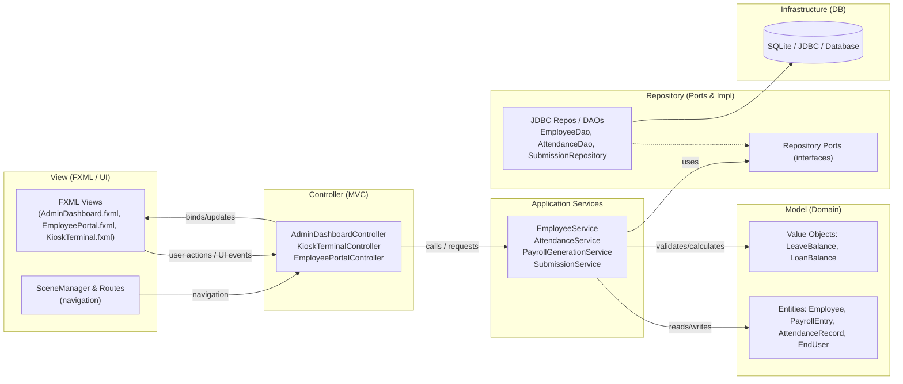
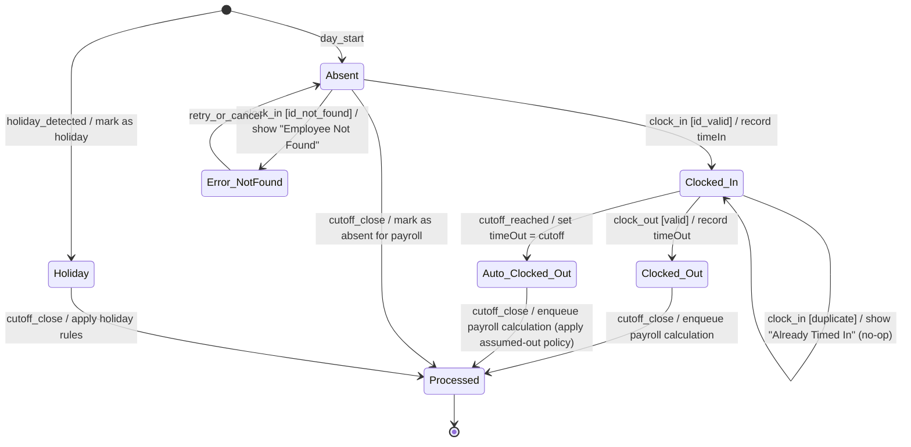
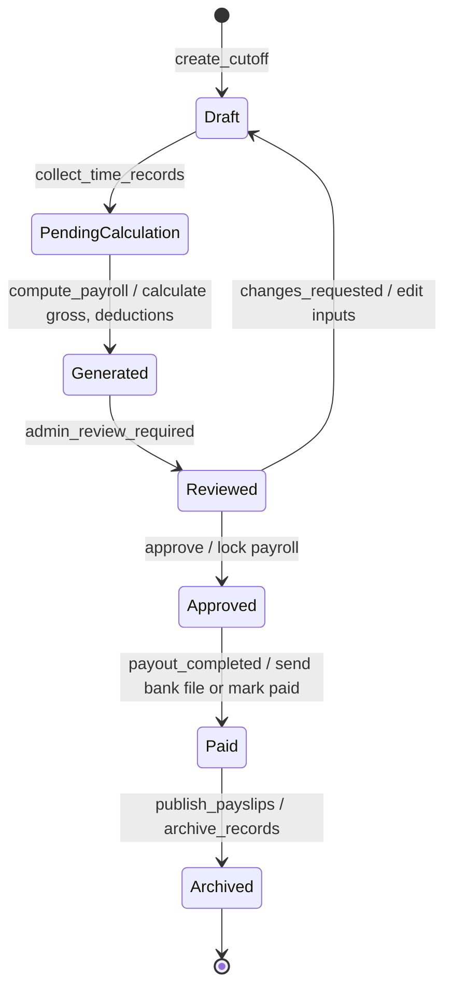
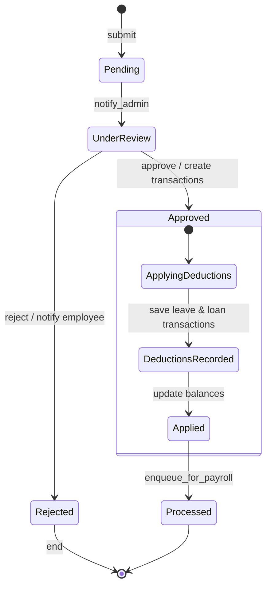

# Payroll Management System: UML Design Document

---

## 1. Class Diagram

---

## 2. Use Case Diagram

---

## 3. MVC / Architecture Diagram

---

## 4. State Diagrams

### Employee Attendance Lifecycle

### Payroll Processing Lifecycle

### Leave and Submission Lifecycle

