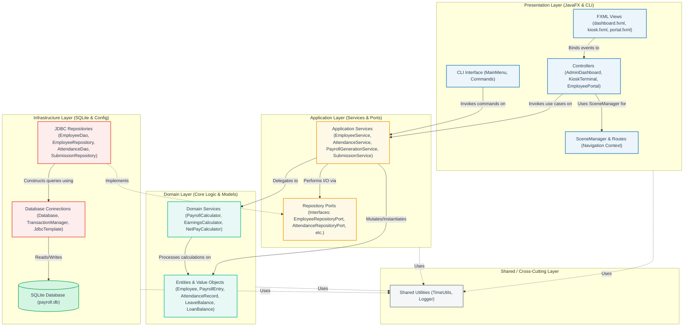
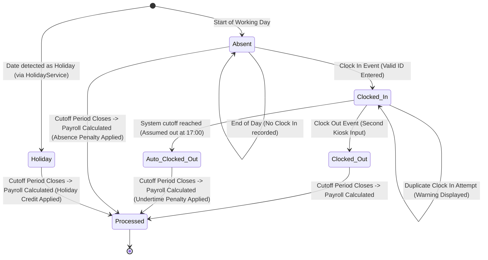
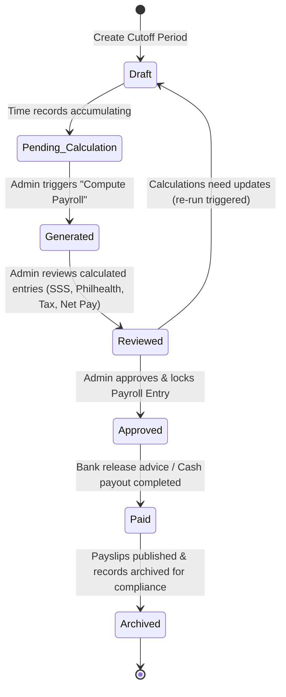
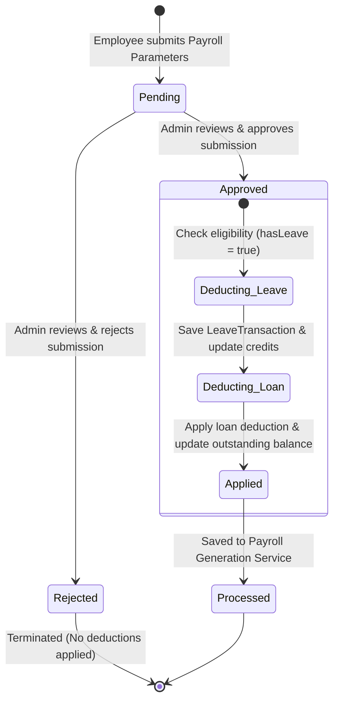
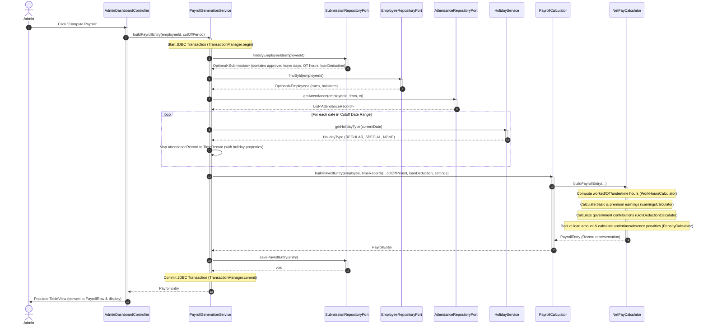
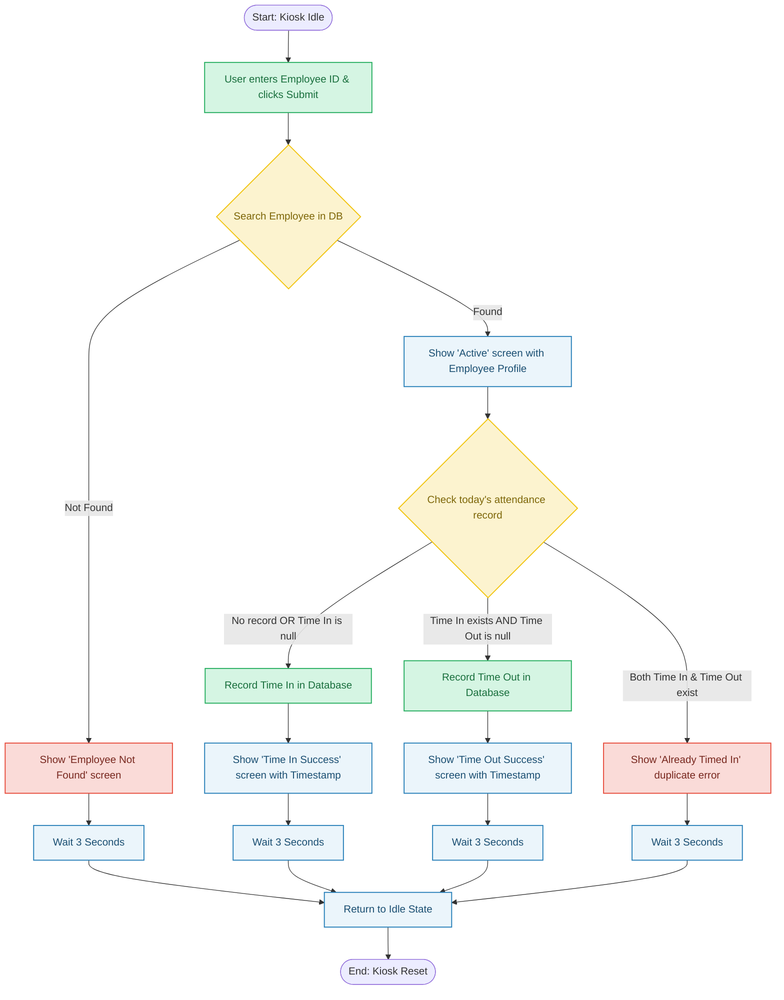
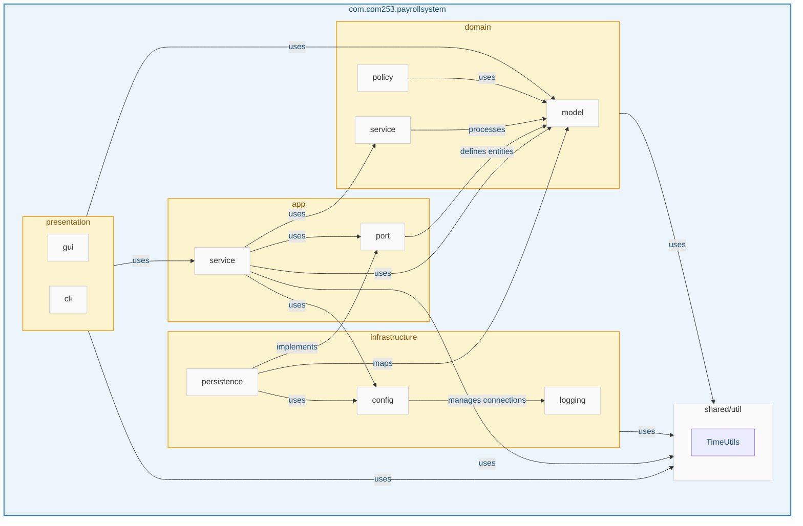

# Payroll Management System: UML Design Document

---

## 1. Class Diagram

```mermaid
classDiagram
    %% --- PRESENTATION LAYER ---
    class SceneManager {
        -SceneManager instance$
        -Map~Screen, Scene~ sceneCache
        -Map~Screen, Object~ controllerCache
        -Stage primaryStage
        -Screen currentScreen
        -SceneManager()
        +getInstance() SceneManager$
        +initialize(Stage stage) void
        +switchScene(Screen screen) void
        +switchScene(Stage stage, Screen screen) void
        +showModal(Screen screen, String title) Stage
        +getController(Screen screen, Class~T~ clazz) T
        +clearCache() void
    }

    class Routes {
        <<enumeration>>
        ADMIN_DASHBOARD
        ADMIN_EMPLOYEES
        ADMIN_ATTENDANCE
        ADMIN_PAYROLL
        ADMIN_REPORTS
        EMPLOYEE_LOGIN
        EMPLOYEE_DASHBOARD
        KIOSK_IDLE
        KIOSK_ACTIVE
        +getFxmlPath() String
        +getCssPath() String
        +getModule() String
    }

    class AdminDashboardController {
        -EmployeeService employeeService
        -AttendanceService attendanceService
        -SimplePayrollService payrollService
        -ObservableList~Employee~ employees
        -ObservableList~AttendanceRow~ attendanceRows
        -ObservableList~PayrollRow~ payrollRows
        +initialize() void
        +showEmployees() void
        +saveEmployee() void
        +loadAttendance() void
        +computePayroll() void
        +handleLogout() void
    }

    class KioskTerminalController {
        -EmployeeService employeeService
        -AttendanceService attendanceService
        -StringBuilder enteredId
        -Employee currentEmployee
        +initialize() void
        +handleSubmit() void
        +handleTimeIn() void
        +handleTimeOut() void
        -processAutoAttendance(Employee emp) void
    }

    class EmployeePortalController {
        +initialize() void
        +handleLogin() void
        +switchToFirstCutoff() void
        +switchToSecondCutoff() void
        +handleDownloadPdf() void
    }

    %% --- APPLICATION LAYER (SERVICES & PORTS) ---
    class AuthService {
        -AccountRepository accountRepository
        +authenticate(String user, String pass) EndUser
    }

    class EmployeeService {
        -AccountRepositoryPort accountRepository
        -EmployeeRepositoryPort employeeRepository
        +registerEmployee(Employee emp, String user, String pass) void
        +saveEmployee(Employee emp) void
        +findEmployee(String id) Employee
        +getAllEmployees() List~Employee~
        +deleteEmployee(String id) void
    }

    class AttendanceService {
        -AttendanceRepositoryPort attendanceRepository
        +clockIn(String empId, LocalDate date, double time) void
        +clockOut(String empId, LocalDate date, double time) void
        +upsertAttendance(String empId, LocalDate date, Double timeIn, Double timeOut) void
        +getAttendanceHistory(String empId, LocalDate from, LocalDate to) List~AttendanceRecord~
    }

    class SubmissionService {
        -EmployeeRepositoryPort employeeRepository
        -SubmissionRepositoryPort submissionRepository
        -DeductionService deductionService
        +submitPayroll(String empId, double leaves, double ot, double loan) boolean
        +getPendingSubmissions() List~Submission~
        +updateSubmissionStatus(int subId, Status status, String cutoff) void
        +buildPayrollEntry(String empId, String cutoff) PayrollEntry
    }

    class PayrollGenerationService {
        -AttendanceRepositoryPort attendanceRepository
        -EmployeeRepositoryPort employeeRepository
        -SubmissionRepositoryPort submissionRepository
        +buildPayrollEntry(String empId, String cutoff) PayrollEntry
        -buildTimeRecords(String empId, LocalDate from, LocalDate to) List~TimeRecord~
    }

    class DeductionService {
        -EmployeeRepositoryPort employeeRepository
        -LeaveTransactionRepositoryPort leaveTransactionRepository
        -LoanTransactionRepositoryPort loanTransactionRepository
        +applyDeductions(Employee emp, int leaves, double loan, String cutoff) void
        +getLeaveHistory(String empId) List~LeaveTransaction~
        +getLoanHistory(String empId) List~LoanTransaction~
    }

    class HolidayService {
        -int year
        +getHolidayType(LocalDate date) HolidayType
    }

    class AccountRepositoryPort {
        <<interface>>
        +save(EndUser user) void
        +findByUsername(String user) Optional~EndUser~
        +deleteByEmployeeId(String empId) void
    }

    class EmployeeRepositoryPort {
        <<interface>>
        +findById(String id) Optional~Employee~
        +findAll() List~Employee~
        +save(Employee emp) void
        +delete(String id) void
        +updateLeaveBalance(String id, LeaveBalance bal) void
        +updateLoanBalance(String id, LoanBalance bal) void
    }

    class AttendanceRepositoryPort {
        <<interface>>
        +clockIn(String id, LocalDate date, double time) void
        +clockOut(String id, LocalDate date, double time) void
        +getAttendance(String id, LocalDate from, LocalDate to) List~AttendanceRecord~
        +upsert(String id, LocalDate date, Double timeIn, Double timeOut) void
    }

    class SubmissionRepositoryPort {
        <<interface>>
        +save(Submission sub) boolean
        +findById(int id) Optional~Submission~
        +findByEmployeeId(String empId) Optional~Submission~
        +findAllPending() List~Submission~
        +updateStatus(int id, Status status) void
        +savePayrollEntry(PayrollEntry entry) void
        +deleteByEmployeeId(String empId) void
    }

    %% --- INFRASTRUCTURE PERSISTENCE ---
    class Database {
        +getConnection() Connection$
        +close(Connection conn)$
    }

    class TransactionManager {
        +begin(Connection conn)$
        +commit(Connection conn)$
        +rollback(Connection conn)$
    }

    class EmployeeRepository {
        +findById(String id) Optional~Employee~
    }

    class EmployeeDao {
        +findById(String id) Optional~Employee~
    }

    class AttendanceRepository {
        +getAttendance(...) List~AttendanceRecord~
    }

    class AttendanceDao {
        +getAttendance(...) List~AttendanceRecord~
    }

    class SubmissionRepository {
        +save(Submission sub) boolean
    }

    %% --- DOMAIN LAYER ---
    class Employee {
        -String employeeId
        -String name
        -EmployeeType type
        -double monthlyRate
        -double hourlyRate
        -boolean hasLeave
        -LeaveBalance leaveBalance
        -LoanBalance loanBalance
        +getEmployeeId() String
        +getName() String
        +getLeaveBalance() LeaveBalance
        +getLoanBalance() LoanBalance
        +setLeaveBalance(LeaveBalance bal) void
        +setLoanBalance(LoanBalance bal) void
    }

    class EndUser {
        -String username
        -String passwordHash
        -Role role
        -String linkedEmployeeId
        +getUsername() String
        +getRole() Role
    }

    class LeaveBalance {
        -int sick
        -int vacation
        -int emergency
        +deduct(int days) DeductionResult
        +apply(DeductionResult res) LeaveBalance
        +getTotal() int
    }

    class LoanBalance {
        -double balance
        +deduct(double amount) double
        +apply(double deducted) LoanBalance
        +getBalance() double
    }

    class AttendanceRecord {
        -String employeeId
        -LocalDate recordDate
        -Double timeIn
        -Double timeOut
        +getTimeIn() Double
        +getTimeOut() Double
    }

    class TimeRecord {
        -int dayOfMonth
        -int timeIn
        -int timeOut
        -boolean isAbsent
        -HolidayType holidayType
    }

    class PayrollEntry {
        <<record>>
        +Employee employee
        +String cutOffPeriod
        +double totalHoursWorked
        +double overtimeHours
        +double basicPay
        +double overtimePay
        +double grossPay
        +double sssDeduction
        +double netPay
    }

    class Submission {
        -int submissionId
        -String employeeId
        -double leaveDays
        -double otHours
        -double loanDeduction
        -Status status
    }

    class PayrollCalculator {
        +computeHoursWorked(TimeRecord rec, PayrollSettings set) double$
        +computeGrossPay(Employee emp, TimeRecord[] recs, PayrollSettings set) double$
        +buildPayrollEntry(...) PayrollEntry$
    }

    class NetPayCalculator {
        +buildPayrollEntry(Employee emp, TimeRecord[] recs, String cutoff, double loan, PayrollSettings set) PayrollEntry$
    }

    %% --- RELATIONSHIPS ---
    SceneManager o--> Routes
    AdminDashboardController --> EmployeeService
    AdminDashboardController --> AttendanceService
    KioskTerminalController --> EmployeeService
    KioskTerminalController --> AttendanceService
    EmployeePortalController --> AuthService

    EmployeeService --> AccountRepositoryPort
    EmployeeService --> EmployeeRepositoryPort
    AttendanceService --> AttendanceRepositoryPort
    SubmissionService --> EmployeeRepositoryPort
    SubmissionService --> SubmissionRepositoryPort
    SubmissionService --> DeductionService
    PayrollGenerationService --> AttendanceRepositoryPort
    PayrollGenerationService --> EmployeeRepositoryPort
    PayrollGenerationService --> SubmissionRepositoryPort
    DeductionService --> EmployeeRepositoryPort
    DeductionService --> LeaveTransactionRepositoryPort
    DeductionService --> LoanTransactionRepositoryPort

    EmployeeRepositoryPort <|.. EmployeeRepository
    EmployeeRepositoryPort <|.. EmployeeDao
    AttendanceRepositoryPort <|.. AttendanceRepository
    AttendanceRepositoryPort <|.. AttendanceDao
    SubmissionRepositoryPort <|.. SubmissionRepository

    Employee *-- LeaveBalance
    Employee *-- LoanBalance
    EndUser --> Employee : linkedEmployeeId
    PayrollEntry o--> Employee
    Submission o--> Employee
    TimeRecord --> HolidayType : references

    PayrollGenerationService ..> HolidayService : uses
    PayrollGenerationService ..> PayrollCalculator : uses
    PayrollCalculator ..> NetPayCalculator : delegates
    NetPayCalculator ..> PayrollEntry : instantiates
```

---

## 2. Use Case Diagram

---

## 3. MVC / Architecture Diagram

---

## 4. State Diagrams

### Employee Attendance Lifecycle

### Payroll Processing Lifecycle

### Leave and Submission Lifecycle

---

## 5. Sequence Diagram: Payroll Generation

---

## 6. Activity Diagram: Kiosk Attendance Flow

---

## 7. Package Diagram

